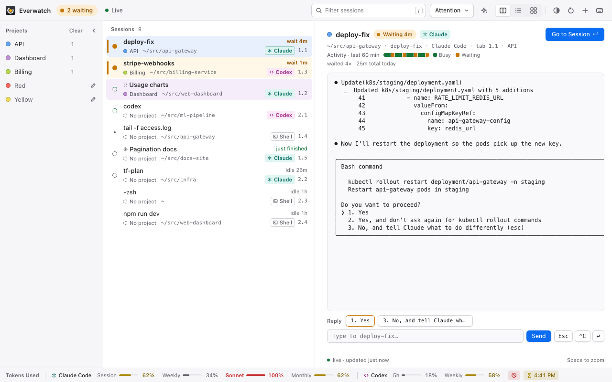
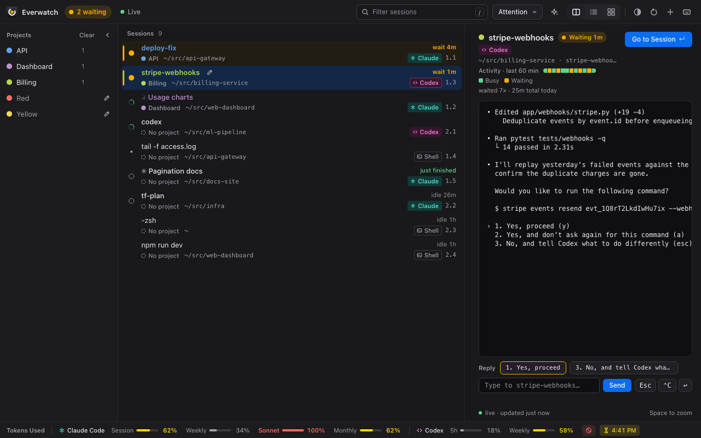
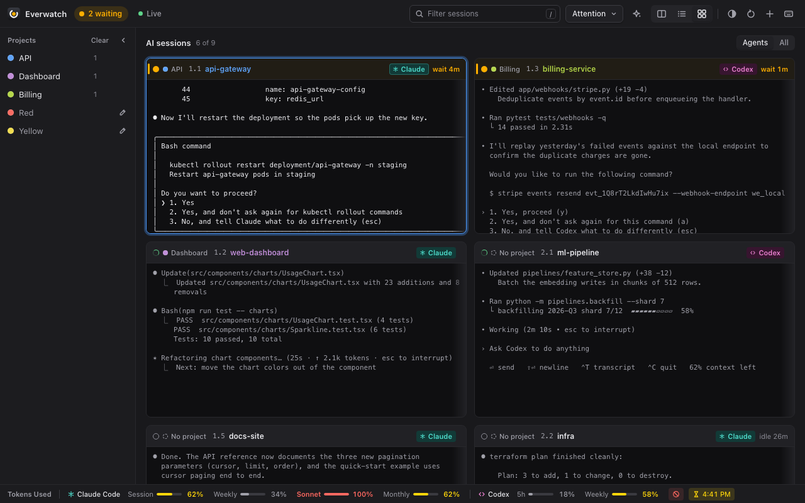
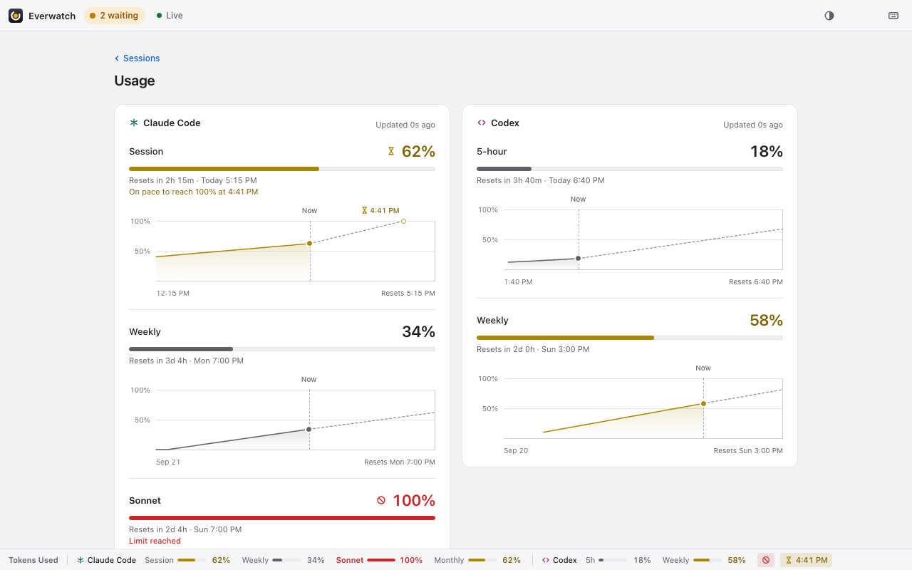
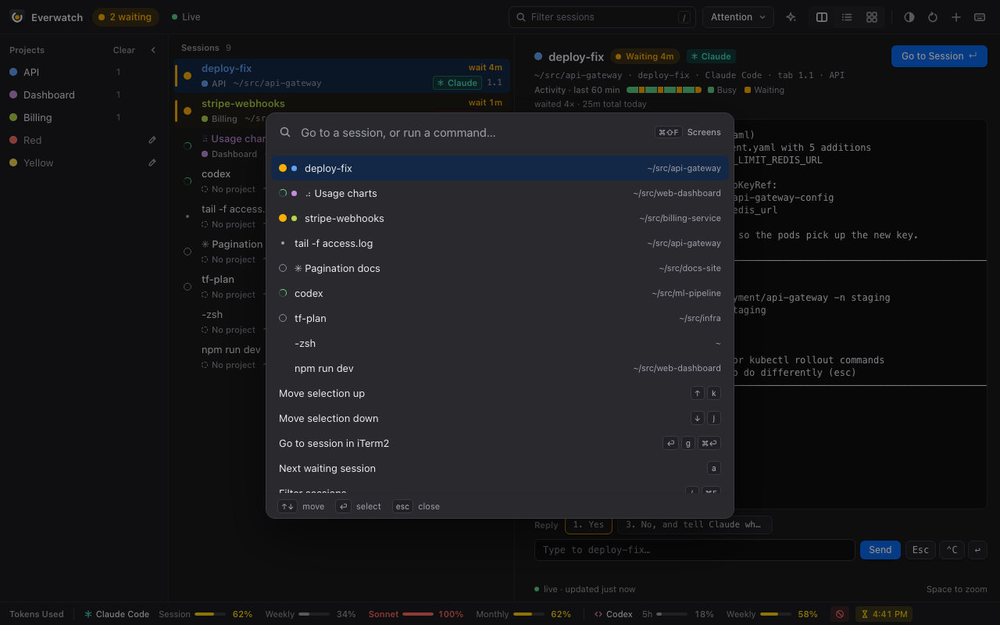
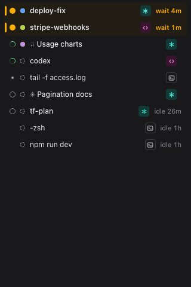
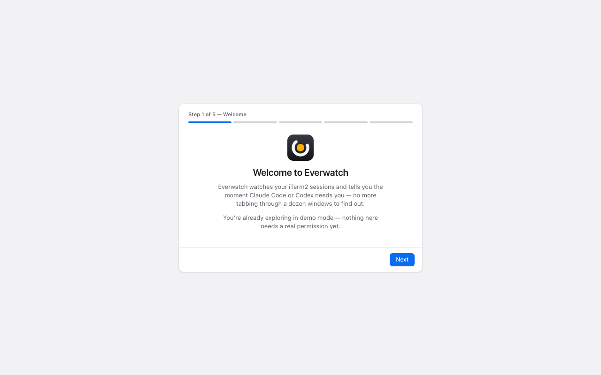

<p align="center"></p>

# Everwatch

**Who needs me right now, and what are they doing?**

Everwatch is a small macOS app that watches your iTerm2 sessions and tells
you which AI coding agent — Claude Code, Codex — is busy, waiting on you,
or idle, with a live preview of what it's doing. It's a graphical
reimagining of [ultrawatch](https://github.com/burnsbert/ultrawatch-for-iterm2)
(a curses TUI), which was itself a reimagining of
[overwatch](https://github.com/burnsbert/overwatch-for-iterm2). Everwatch
keeps ultrawatch's engine and behavior, and puts it in its own window, menu
bar item, and floating panel — so you don't need a dedicated terminal tab
to see who's stuck waiting for you.

<picture>
  <source media="(prefers-color-scheme: dark)" srcset="docs/screenshots/hero-dark.png">
  <source media="(prefers-color-scheme: light)" srcset="docs/screenshots/hero-light.png">
  
</picture>

## Why Everwatch

- **See who's stuck, at a glance.** A waiting session gets an amber
  highlight, a menu-bar count, and a silent notification you can click to
  jump straight to it — in iTerm2, not a separate terminal.
- **Live previews without switching tabs.** Split, list, and grid ("camera
  wall") layouts show the tail of every session's screen, so you can read
  a permission prompt or a stack trace before you tab over.
- **Usage limits you can actually see coming.** Every Claude Code and
  Codex quota is always on screen in the "Tokens Used" bar, yellow at 50%,
  red at 80%, with an hourglass and a run-out time when you're on pace to
  hit a limit before it resets — plus burn-down charts in the Usage view.
- **Keyboard-first, mouse-friendly.** Every feature works from the
  keyboard (with a command palette, ⌘K, if you'd rather search than
  memorize), and works fine with a mouse if you'd rather not.
- **Try it before you trust it.** `everwatch demo` runs a realistic,
  scripted fleet of sessions — no permissions, no real iTerm2 required.
- **Nothing leaves your Mac.** The backend is a localhost-only server with
  a per-launch token. No telemetry, no accounts, no network calls except
  the ones you already trust (Anthropic/OpenAI usage APIs, GitHub for
  updates).

## Feature tour

**Split view** — session list plus a live preview, resizable with `<`/`>`.
Each row says who it is ("Claude", "Codex", or an outlined "Shell"), where
it is (project chip and path), and how long it's been waiting; a session
with a project reads in that project's color at a glance (the title text
in dark mode, a subtle row tint in light mode). The bottom bar is the
always-visible "Tokens Used" strip, with a small chip for every
on-pace-to-run-out or hit-limit warning, side by side.



**Live preview + reply** — the selected session's preview refreshes about
once a second, and a reply bar under it types into the session: answer a
Claude Code or Codex prompt with one click, interrupt with Esc or ⌃C, or
send a follow-up.

**Grid view** — a camera wall of every AI session at once (the Agents/All
switch adds plain shells).



**Usage limits** — Claude Code and Codex windows, with burn-down charts and
an on-pace-to-hit warning. Click any quota in the Tokens Used bar to jump
here.



**Command palette (⌘K)** — fuzzy "go to session…" plus every command in
the keymap, including screen search (⌘⇧F).



**Compact mode (⌘\\)** — a small floating panel that sits beside iTerm2;
the agent badges shrink to their glyphs but never disappear.



**Onboarding** — a short guided walkthrough, starting with this welcome step, that ends with the one permission Everwatch needs.



## 60-second install

**Recommended — one-liner:**

```bash
curl -fsSL https://raw.githubusercontent.com/burnsbert/everwatch/main/install.sh | bash
```

This checks macOS ≥ 13 and that iTerm2 is installed, finds a Python 3.9+ on
your system (never triggering the Xcode Command Line Tools install
dialog), downloads and verifies the latest release, installs the runtime
under `~/Library/Application Support/Everwatch/`, and installs
`Everwatch.app` to `~/Applications`. No `sudo`, ever. It'll offer to open
Everwatch for you when it's done; after that, just run `everwatch` any
time (or open Everwatch from Spotlight or Applications) — no flags or
subcommands needed. Run
`curl -fsSL .../install.sh | bash -s -- --help` (or see [below](#cli-reference))
for flags like `--browser-only` and `--with-colors`.

**From source:**

```bash
git clone https://github.com/burnsbert/everwatch.git
cd everwatch
make install
```

**Try it without granting anything:**

```bash
everwatch demo
```

This runs a deterministic, scripted demo fleet of sessions in your
browser (or the app, if installed) — no iTerm2, no permissions, no real
data.

## First launch & permissions

Everwatch asks for exactly **one** macOS permission: the first time it
polls iTerm2, macOS should show

> **"Everwatch" wants to control "iTerm2".**

Click **OK**. (If it instead names "Python"/"python3" — unverified on some
macOS versions — toggle iTerm2 under whichever app name showed, then
confirm with `everwatch doctor`.) That's it — notifications and tab colors
are optional and covered below. See [docs/PERMISSIONS.md](docs/PERMISSIONS.md)
for a step-by-step guide to every permission state (not asked yet, granted,
denied, iTerm2 not running, Python API disabled) and its exact fix.

**If you clicked "Don't Allow" by mistake:** System Settings → Privacy &
Security → Automation → find **Everwatch** → enable **iTerm2**, then let
Everwatch refresh (or click **Diagnose** in the app). If Everwatch doesn't
appear in that list at all, run:

```bash
tccutil reset AppleEvents io.github.burnsbert.everwatch
```

then relaunch Everwatch so it asks again.

**Notifications** and the waiting count on the Dock icon are separate Settings
options, both off by default. Notifications are always silent — Everwatch never plays a
sound unless you turn on "sound on attention" in Settings (off by
default). Clicking a notification jumps straight to that session in
iTerm2.

**Tab colors** are optional. They need two things:

1. In iTerm2: **Settings → General → Magic → Enable Python API**.
2. In Everwatch: Settings (or the onboarding wizard) → **Enable tab
   colors**. This creates a small private Python environment
   (`~/Library/Application Support/Everwatch/venv`) and installs the
   `iterm2` package into it — nothing is installed system-wide. iTerm2
   shows a one-time "allow connection" dialog the first time it connects.

Without either step, Everwatch works exactly the same — no error, no tab
color dots, and the project-color keys (`1`–`5`, `0`) just don't do
anything.

## Usage basics

- **Split / List / Grid views** (`v`, or ⌘1/⌘2/⌘3): split shows a session
  list beside a live preview; list is a denser full-width table; grid is a
  camera wall of every agent session (press `A` to include plain shells).
- **AI sessions only**: the sparkle button in the toolbar (or `i`) hides
  plain shells from every view — the list header then says "AI sessions"
  with a "6 of 9" count, so a shorter list never looks like missing
  sessions. Remembered across launches.
- **Selection**: ↑↓ or `j`/`k` move the selection; `⏎`/`g`/⌘⏎ or a
  double-click jumps to that session in iTerm2.
- **Waiting sessions**: press `a` to jump to the longest-waiting session;
  the amber "N waiting" pill in the toolbar does the same on click.
- **Filter and sort**: `/` (or ⌘F) fuzzy-filters by path, name, or label;
  `s` cycles sort order (natural → attention → agents → activity → path).
- **Labels and projects**: `l` renames a session; `p` (or clicking the
  rail/handle) expands the projects column pinned to the left edge — a
  vertical accordion, collapsed by default to a slim rail showing the 5
  project dots, expanding to the full list (5 color-coded slots, unnamed
  ones showing their color name — click, Enter, or the pencil icon to
  rename; the × that appears on hover clears just that slot; "Clear" in
  the header clears them all); `1`–`5` assigns the selected session's tab
  color to a project, `0` clears it.
- **Every session row/tile at a glance**: a project chip (dot + name, or
  "No project") is always visible — never just a small color dot — and
  click it (or right-click the row) for a "Project / tab color" menu of
  all 5 slots. Claude Code and Codex sessions get a badge with a glyph and
  the word ("✳ Claude" teal, "‹› Codex" magenta; glyph-only in compact mode
  and a narrow list, with the full name in the tooltip) and plain shells an
  outlined "Shell" badge, so an AI session and a shell are told apart at a
  glance in every row/tile state, selected or not. Hover any glyph, badge,
  chip, or tab label for its meaning in words. A pencil
  icon next to the name (hover or focus) is a second way into rename,
  beside double-click, `l`, and the context menu's "Rename…".
- **Activity strip**: the little busy/waiting timeline on each row/tile is
  off by default (Settings → Display → "Show activity strip on
  sessions") — it always stays on the selected session's own preview,
  labelled "Activity · last 60 min" with a busy/waiting legend.
- **Reply to a session**: click the box under the preview and type; `↩`
  sends the text and presses Return, `⇧↩` types it without Return, and
  `esc` leaves the box (keys typed there never trigger Everwatch's own
  shortcuts). The `Esc`, `⌃C`, and `↩` buttons send those keys. When the
  screen shows a Claude Code / Codex menu or a `[y/N]` question, one
  button per answer appears above the box. A button only sends if the
  screen still looks exactly like it did when you clicked (otherwise you
  get a "screen changed" toast), and "don't ask again" / "always"
  answers never get a button — type the number yourself if you mean it.
  Nothing is ever sent without a click or a keypress. The selected
  session's preview refreshes about once a second while it's on screen
  (`EVERWATCH_LIVE_INTERVAL=<seconds>` changes that); other sessions keep
  the normal 2-second cadence. Not in compact mode. Full terminal
  emulation is a [future goal](docs/ROADMAP.md).
- **Tokens Used**: the bottom bar always shows every Claude Code and Codex
  quota (session, weekly, Sonnet, monthly/extra; Codex 5-hour and weekly):
  yellow from 50%, red from 80%. Every quota that's on pace to run out
  before it resets, or that's already hit, gets its own small chip — an
  hourglass with the projected run-out time, or a stop mark — side by
  side, separate from the meters. Hover (or Tab to) a quota or a chip for
  its full name, usage, reset time, and warning. The strip can't be
  hidden; in a narrow window it shortens labels and chips, then shows the
  worst quota (and worst chip) per provider — it never overflows. Click
  any quota or chip (or press `u`) for the full Usage view with burn-down
  charts; `$` toggles dollar amounts.
- **Command palette**: ⌘K for fuzzy "go to session…" and every command by
  name; ⌘⇧F searches the visible screen text of every session at once.
- **Compact mode**: ⌘\\ opens a small floating panel that stays on top,
  useful if you don't want a second full-size window.
- **Theme**: the sun/moon/auto button in the toolbar (or `t`) cycles Light
  → Dark → Match System; the same choice as Settings → Appearance.

## Keyboard shortcuts

The table below is generated from the app's own keymap
(`everwatch/web/js/keymap.mjs`), so it can't drift from what pressing `?`
shows in the app. Regenerate it with `make docs-keys` after changing that
file.

<!-- keys:start -->
**Navigate**

| Keys | Action |
|---|---|
| `↑` / `k` | Move selection up |
| `↓` / `j` | Move selection down |
| `↑↓←→` | Move around the grid |
| `⏎` / `g` / `⌘⏎` | Go to session in iTerm2 |
| `a` | Next waiting session |
| `/` / `⌘F` | Filter sessions |
| `s` | Cycle sort order |
| `esc` | Back: clear filter, then selection |

**Act**

| Keys | Action |
|---|---|
| `l` | Rename (label) session |
| `n` | New iTerm2 tab |
| `x` | Close tab… |
| `1–5` | Color tab → project 1–5 |
| `0` | Clear tab color |
| `p` | Show/hide projects |
| `c` | Clear all projects… |
| `r` / `⌘R` | Refresh now |

**View**

| Keys | Action |
|---|---|
| `v` | Cycle view (split → list → grid) |
| `⌘1` | Split view |
| `⌘2` | List view |
| `⌘3` | Grid view |
| `space` | Zoom preview |
| `esc` / `space` | Leave zoom |
| `>` / `.` | Widen list pane |
| `<` / `,` | Narrow list pane |
| `i` | AI sessions only / all sessions |
| `A` | Grid: AI sessions / all sessions |
| `u` | Usage limits |
| `t` | Theme: switch light / dark mode |
| `u` / `esc` / `q` | Close usage |
| `?` / `⌘/` | Keyboard shortcuts |

**System**

| Keys | Action |
|---|---|
| `$` | Show/hide dollar amounts |
| `b` | Sound on attention on/off |
| `⌘K` / `⌃K` | Command palette |
| `⌘⇧F` | Search screen contents |
| `⌘\` | Compact floating window |
| `⌘,` | Settings |
| `q` | Close overlay (⌘Q quits) |

<!-- keys:end -->

## CLI reference

Installing puts an `everwatch` command on your `PATH` (`~/.local/bin`).

```
everwatch [-h] [--version] {serve,open,demo,app,state,doctor,update,uninstall} ...
```

| Command | What it does |
|---|---|
| `everwatch` (no command) or `everwatch app` | Opens the installed `Everwatch.app` — the everyday way to start Everwatch. Falls back to `everwatch open`'s browser mode if there's no native app installed (`--browser-only`). |
| `everwatch open` | Runs the backend and opens it in your default browser (no app installed, or `--browser-only`). No menu bar, native notifications, or global hotkeys in this mode. |
| `everwatch serve` | Runs the backend only (used by `Everwatch.app` itself; `--port`, `--token`, `--parent-pipe`, etc.). |
| `everwatch demo` | `serve --demo`, then opens a browser — a scripted, deterministic fleet of sessions, no permissions needed. |
| `everwatch state` | Dumps the current state as JSON (`--demo` for the demo fleet). Handy for scripting or filing a bug report. |
| `everwatch doctor` | Prints the same checks as the onboarding wizard / Settings → Diagnostics, as a terminal table (`--json` for raw output). Exits 1 if any check is an error. |
| `everwatch update [--yes] [--no-open]` | Re-downloads and re-runs the installer for the latest release. A runtime-only update leaves `Everwatch.app` untouched, so your Automation grant survives. |
| `everwatch uninstall [--purge] [--yes]` | Removes the app, runtime, venv, and CLI link. Keeps `state.json` unless `--purge`, which also resets the Automation permission grant. |

`everwatch --version` prints the CLI's version (plus the installed runtime
and shell versions, when running from an install rather than a checkout).

### `install.sh` flags

```
curl -fsSL https://raw.githubusercontent.com/burnsbert/everwatch/main/install.sh | bash -s -- [flags]
```

| Flag | What it does |
|---|---|
| `--browser-only` | Skip the native app; use `everwatch open` instead. |
| `--with-colors` | Also set up the optional iTerm2 tab-color integration. |
| `--prefix DIR` | Install under `DIR` instead of your real home directory (testing, advanced setups). The `everwatch` CLI it installs manages only that prefix; the prefix's `Everwatch.app` still uses `~/Library/Application Support/Everwatch` unless launched with `EVERWATCH_HOME` set. |
| `--version X` | Install a specific release instead of the latest. |
| `--from-local DIR` | Use a local checkout or extracted build instead of downloading anything. |
| `--uninstall` | Remove the app, runtime, venv, and CLI link (same as `everwatch uninstall`). |
| `--purge` | With `--uninstall`, also delete `state.json` and reset the Automation grant (same as `everwatch uninstall --purge`) — works even after the CLI link is already gone. |
| `--yes` | Never prompt; assume yes. |
| `--no-open` | Don't offer to open Everwatch when finished. |
| `--help` | Show the full help text. |

The installer never asks for `sudo` and never plays a sound.

## Troubleshooting / FAQ

**Run `everwatch doctor` first.** It checks Python, iTerm2, the Automation
permission, agent detection, usage-API status, tab colors, notifications,
hotkeys, and more — the same checks the in-app Settings → Diagnostics
panel shows, with the fix for whatever's wrong. See
[docs/PERMISSIONS.md](docs/PERMISSIONS.md) for permission-specific detail.

**"Everwatch" isn't in the Automation list in System Settings.** Run
`tccutil reset AppleEvents io.github.burnsbert.everwatch`, then relaunch
Everwatch so macOS prompts again. This also clears a stale/phantom grant
left over from an earlier build.

**Logs.** The backend's output goes to
`~/Library/Logs/Everwatch/backend.log` (rotated at 1&nbsp;MB × 3), so
library noise never reaches the UI. Attach this file if you file a bug.

**Keychain prompt for "Claude Code-credentials".** Everwatch reads your
Claude Code usage the same way the `claude` CLI's own credentials are
stored — via `security find-generic-password`. macOS may show a one-time
Keychain access prompt; choosing "Always Allow" makes it go away for good.

**"python3 not found" / Xcode Command Line Tools dialog.** The installer
looks for Homebrew's `python3` first, and only falls back to
`/usr/bin/python3` if the Command Line Tools are already installed (so it
never pops that installer dialog itself). If neither is present, it prints
the exact command to run: `brew install python` or
`xcode-select --install`.

**Gatekeeper / quarantine.** Files downloaded by `curl` (as opposed to a
browser) carry no quarantine attribute, so Gatekeeper doesn't block the
ad-hoc-signed `Everwatch.app` the installer places in `~/Applications`.
You should never see an "unidentified developer" dialog from the
installer's own download.

**Why is this a separate app instead of an iTerm2 plugin?** A standalone
app gets its own window, Dock icon, menu-bar item, native silent
notifications, and global hotkeys — none of which an iTerm2 Python-API
script can do on its own. An iTerm2 plugin is outside the current scope — see
`docs/DESIGN.md` §6 for the plugin options that were considered and why.

**Privacy.** Everything runs locally. The backend binds `127.0.0.1` only,
on a random free port, and every request needs a 256-bit token generated
fresh at launch — nothing is reachable from another machine on your
network. There's no telemetry and no account. The only outbound network
calls are the ones the feature needs: Claude Code / Codex usage APIs (if
you're signed in to those tools), and GitHub (only when you run
`everwatch update` or check for updates).

## Update / uninstall

```bash
everwatch update              # re-run the installer for the latest release
everwatch uninstall            # remove the app, runtime, venv, CLI link
everwatch uninstall --purge    # also delete saved settings and reset the Automation grant
```

A runtime-only update leaves `Everwatch.app` byte-identical, so your
Automation permission survives it. If the app itself changed, the
installer tells you macOS will ask for permission once more.

If Everwatch.app is running when you update, it's quit gracefully and
relaunched automatically once the update finishes, so you're left running
the new version instead of a stale copy of the old one. `--no-open` skips
the relaunch (you'll need to start it yourself); if it won't quit in time
you'll get a warning telling you to quit and relaunch it by hand.

## Development

```bash
make test        # everything: py, py39, js, swift, shell-integration, e2e, e2e-real, install, lint
make test-fast    # everything except the (slower) shell-integration/end-to-end suites
make docs-keys    # regenerate this README's keyboard-shortcuts table
make screenshots  # regenerate docs/screenshots/*.png headlessly
```

Individual layers: `make test-py` (stdlib `unittest`, ≥90% branch
coverage), `make test-py39` (same suite under the exact Python 3.9.6
shipped with the Command Line Tools), `make test-js` (`node:test` via
`c8`, ≥90% lines / 85% branches), `make test-swift` (Swift Testing, built
with `swiftc`, not SwiftPM), `make test-e2e` (headless Playwright/Chromium
against a demo backend), `make test-e2e-real` (5 smoke tests,
`tests/e2e/real/smoke.spec.mjs`, against the real
`python3 -m everwatch serve --demo` backend instead of a JS fixture
server), `make test-shell-integration` (a headless run of the built
`Everwatch.app` against a demo backend — never a visible window or a
real permission prompt), `make lint` (no-sound lint, parity accounting,
byte-compile).

**Every test layer is headless.** No test opens a visible window, Dock
icon, or menu bar item, drives a real window, calls
`osascript`/`ps`/`lsof`/`security` for real, or touches the network.
`make test-shell-integration` does run the compiled `Everwatch.app`
binary directly (never via `open`) — but as a throwaway, `LSBackgroundOnly`
copy that never shows anything, so it stays headless too
(`scripts/shell_selftest.sh`). Screenshots render offscreen in a headless
browser, never your real screen. See [CONTRIBUTING.md](CONTRIBUTING.md)
for the full rules, including the no-sound rule and the parity-tag
convention.

## Credits

Everwatch reimagines [ultrawatch-for-iterm2](https://github.com/burnsbert/ultrawatch-for-iterm2)
(a curses TUI) as a native-feeling graphical app, keeping its engine and
behavior. ultrawatch was itself a reimagining of
[overwatch-for-iterm2](https://github.com/burnsbert/overwatch-for-iterm2).
See `docs/DESIGN.md` for the full design and parity notes.

## License

[MIT](LICENSE) © Eric Burns
